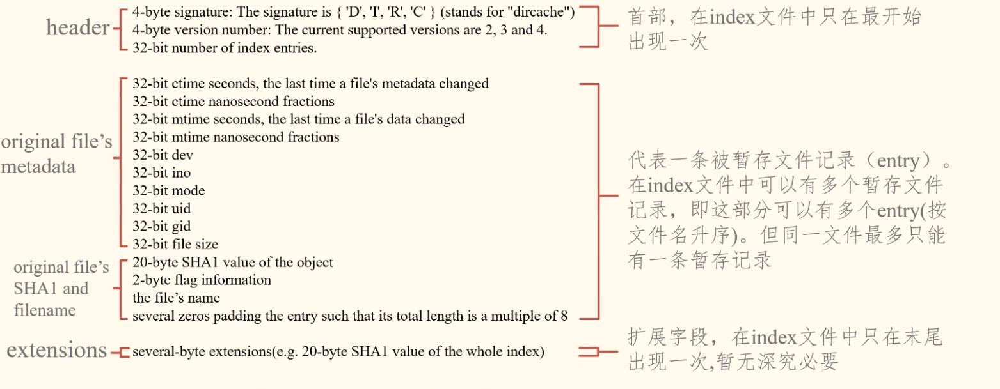
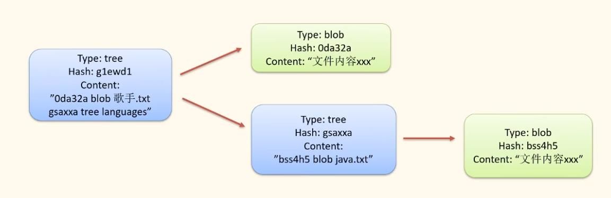
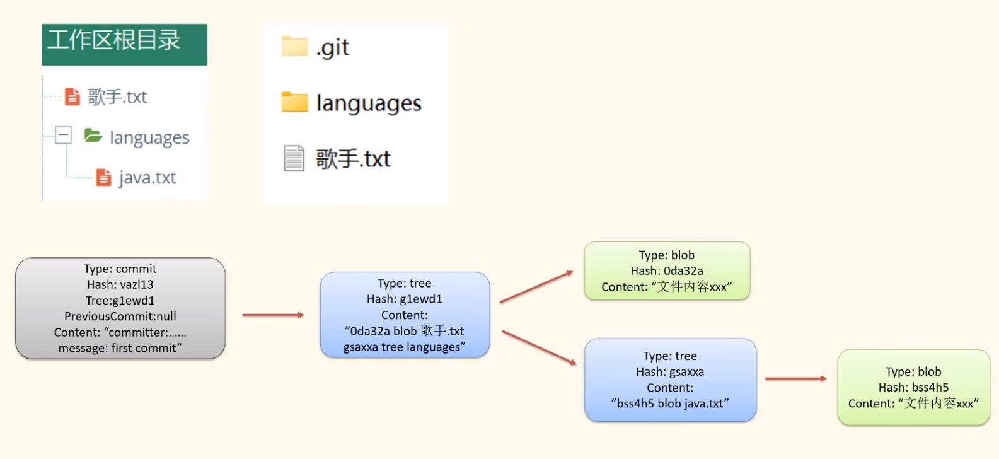
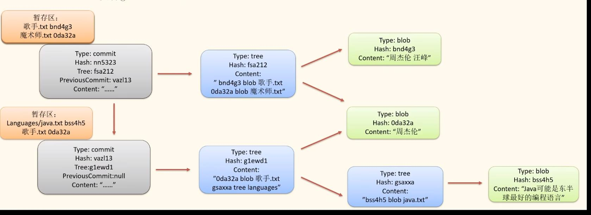

# Git是什么
分布式版本控制系统。
保存版本、切换版本、比较差异、合并版本。

# git的目录结构
```shell
Mode                 LastWriteTime         Length Name
----                 -------------         ------ ----
d-----        2022/11/27     15:49                hooks
d-----        2022/11/27     15:49                info
d-----        2022/11/27     15:50                logs
d-----        2022/11/27     15:50                objects
d-----        2022/11/27     15:55                refs
-a----        2022/11/27     15:50             13 COMMIT_EDITMSG
-a----        2022/11/27     15:55            299 config
-a----        2022/11/27     15:49             73 description
-a----        2022/11/27     15:50             21 HEAD
-a----        2022/11/27     15:49            137 index
```
`.git/objects`路径中存放的就是历史版本。
```bash
zp@Uniml-DevBnd02:~/person/learn-git$ ls .git/objects/ -l
total 24
drwxrwxrwx 2 zp zp 4096 Nov 27 15:50 62
drwxrwxrwx 2 zp zp 4096 Nov 27 15:49 73
drwxrwxrwx 2 zp zp 4096 Nov 27 19:00 75
drwxrwxrwx 2 zp zp 4096 Nov 27 15:49 b0
drwxrwxrwx 2 zp zp 4096 Nov 27 15:49 info
drwxrwxrwx 2 zp zp 4096 Nov 27 15:49 pack
```
其中文件夹名是hash的前两位；
```bash
zp@Uniml-DevBnd02:~/person/learn-git$ ls .git/objects/62 -l
total 4
-r-xr-xr-x 1 zp zp 130 Nov 27 15:50 b120187e18a4730b64d1e317a9114419e685a7
```
文件名是根据文件内容计算的sha1值，共40位，前两位用作创建文件夹，后38位作为文件名。

## objects中文件内容
### blob文件内容
文件内容是zlib算法压缩的文件内容，文件格式是`{原文件类型 tree/blob} {原文件内容字节数} {原文件内容}`。
### tree文件内容
tree文件时zlib压缩的文件夹。

git会把每个文件夹看作一棵树，每个tree文件中 存储在第一层子对象的内容。

`.git/index`是git的暂存区。


## commit文件内容
commit文件也可以用zlib解压，是一个文件，里面记录了根树的hashID、author、committer、备注等数据。

# 提交版本的信息
## add 记录的数据
会创建blob文件

## commit 提交的数据


## 多次commit
新产生的暂存区文件，会记录前一次commit的hash值

类似链表

# 四种文件
| 文件类型 | 文件名                       | 创建时机            | 删除时机           | 更改时机                                                             | 主要内容                                            | 注意事项                                   |
| -------- | ---------------------------- | ------------------- | ------------------ | -------------------------------------------------------------------- | --------------------------------------------------- | ------------------------------------------ |
| blob     | 哈希值，只与原始文件内容有关 | 执行git add时       | 无，创建后一直存在 | 无，不会被更改                                                       | 原文件内容                                          | 即使有多文件内容相同，指挥对应一份blob文件 |
| index    | index                        | 第一次执行git add时 | 无，不会被删除     | add新文件，增加entry;修改文件，修改entry；用add删除文件时，删除entry | 所有blob的entry                                     |
| tree     | 根据tree内容生成的hash值     | 执行git commit时    | 无                 | 无                                                                   | 按字典序升序排列的blob或tree记录                    | 相同的tree只存一份                         |
| commit   | 哈希值，根据commit内容生成   | 执行git commit时    | 无                 | 无                                                                   | 指向的根树的ID、author、committer、备注、parentID等 | 相同的tree只存一份                         |